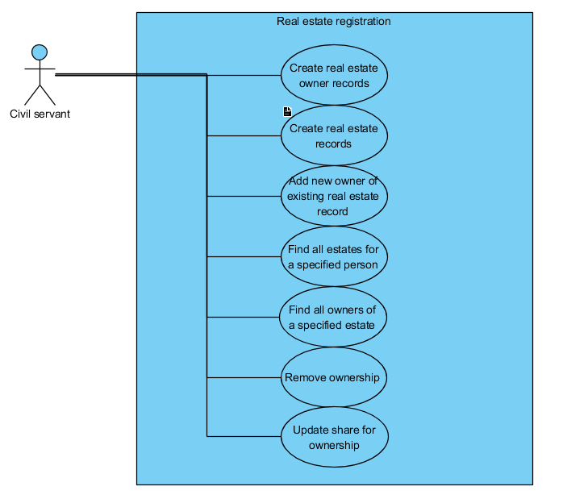
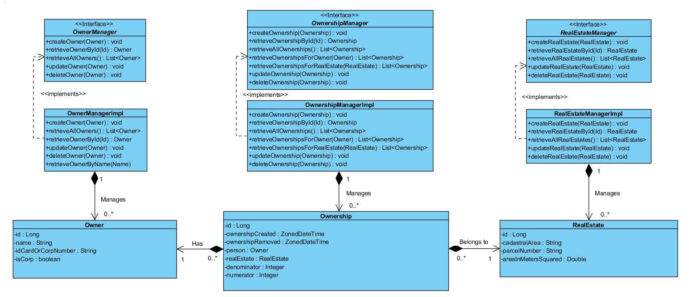
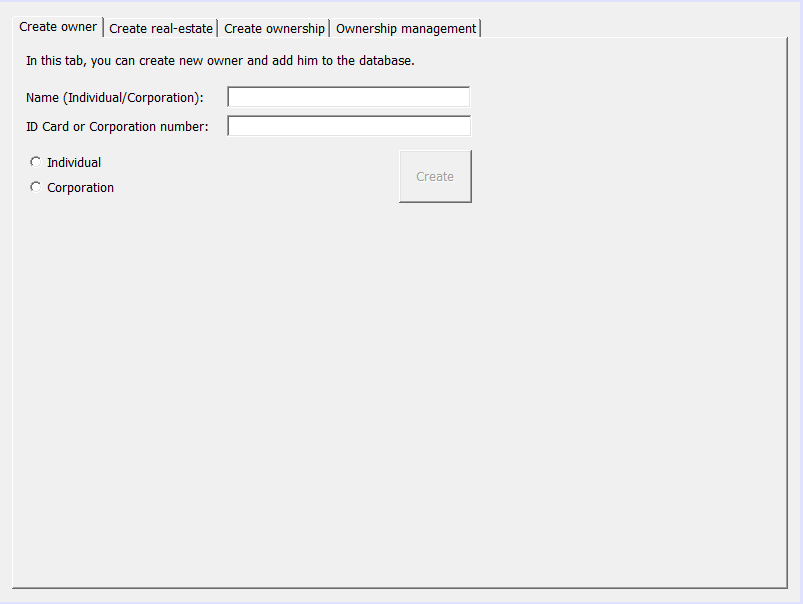
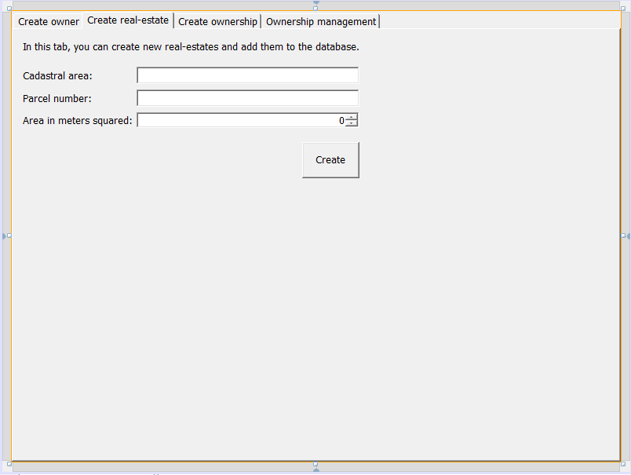
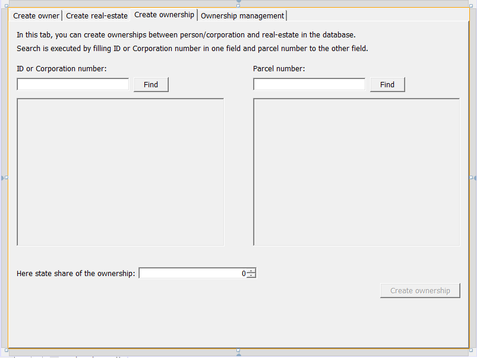
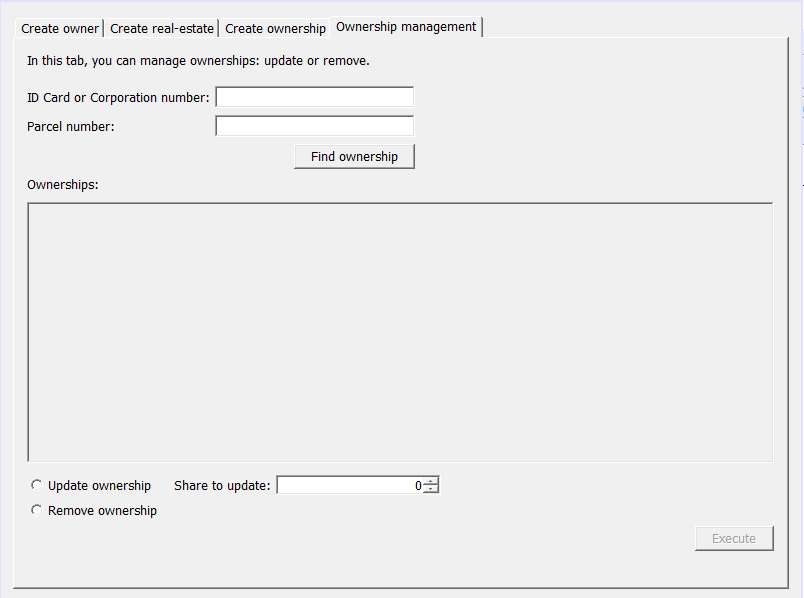

## Real-estate registration

Simplified version of cadastral application for real-estates registration.

Offers civil servants easily manage database of owners, real-estates and ownership records.

Simple grafical interface with sufficient amount of options to manage real-estates registration.

<!--

  

-->

**USE CASE DIAGRAM**

 

**CLASS DIAGRAM**

**GRAPHICAL USER INTERFACE**

**Authors:**

Martin Podhora

Branislav Smolíček
